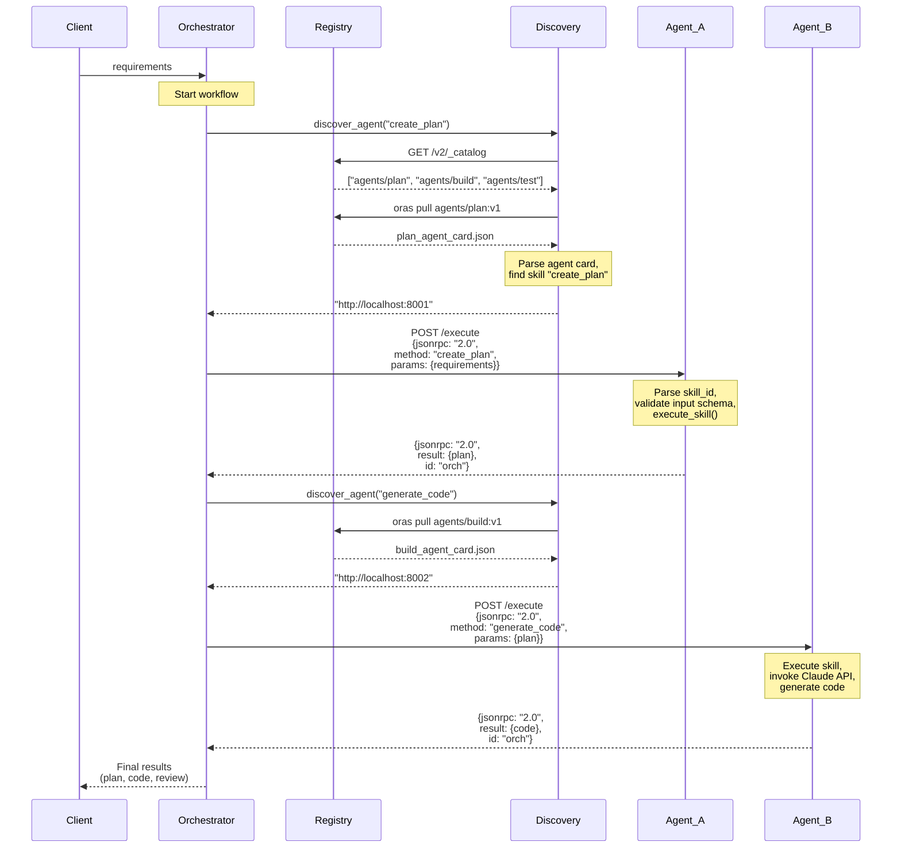

# A2A Pattern: Discovery and Agent-to-Agent Communication

## Overview

This document explains how the Pallet framework discovers agents dynamically through a registry and establishes communication between agents using the A2A protocol.

## Sequence Diagram



## Communication Flow Breakdown

### Phase 1: Agent Discovery

**Step 1: Initiate Discovery**
- Orchestrator requests agent by skill ID: `discover_agent("create_plan")`
- Discovery service is invoked with the required skill identifier

**Step 2: Query Registry**
- Discovery queries OCI registry for all repositories
- Registry returns list: `["agents/plan", "agents/build", "agents/test"]`

**Step 3: Pull Agent Cards**
- For each agent repository, Discovery pulls the agent card using ORAS
- Agent card is a JSON artifact stored in the OCI registry
- Contains agent metadata, URL, and skill definitions

**Step 4: Match Skill**
- Discovery parses the agent card JSON
- Searches for the matching skill ID (`create_plan`)
- Extracts the agent's URL from the agent card

**Step 5: Return Agent URL**
- Discovery returns agent URL to Orchestrator: `"http://localhost:8001"`
- **Key benefit**: Loose coupling - agent location is not hardcoded

### Phase 2: Agent-to-Agent Communication

**Step 1: JSON-RPC Request**
- Orchestrator sends POST request to agent's `/execute` endpoint
- Payload is a JSON-RPC 2.0 request:
  ```json
  {
    "jsonrpc": "2.0",
    "method": "create_plan",
    "params": {"requirements": "..."},
    "id": "orch"
  }
  ```

**Step 2: Agent Processing**
- Agent receives the request at `/execute` endpoint
- Validates the skill ID (`method`) against available skills
- Validates input parameters against the skill's input schema
- Executes the skill (runs domain logic, invokes Claude API, etc.)

**Step 3: JSON-RPC Response**
- Agent returns JSON-RPC 2.0 response:
  ```json
  {
    "jsonrpc": "2.0",
    "result": {"plan": "..."},
    "id": "orch"
  }
  ```
- Response includes execution result or error details

**Step 4: Pipeline Continuation**
- Orchestrator receives result from Agent A
- For next step, repeats discovery process for next required skill
- Chains Agent A's output as input to Agent B
- Process continues for entire workflow pipeline

## Key Architecture Components

### 1. Registry (OCI Artifact Storage)
- Stores agent cards as versioned artifacts
- Accessible via HTTP API (`/v2/_catalog`)
- Agents retrieved via ORAS (OCI Registry as Storage)
- Central source of truth for agent metadata

### 2. Discovery Service
- Queries registry dynamically
- Matches skills to agents
- Returns agent URLs to orchestrator
- Enables capability-based lookup (not URL-based)

### 3. Orchestrator
- Coordinates multi-agent workflows
- Uses discovery to find agents
- Chains agent calls in sequence (or parallel)
- Manages data flow between agents

### 4. Agents
- Expose `/agent-card` endpoint (returns skill definitions)
- Expose `/execute` endpoint (handles JSON-RPC requests)
- Implement domain-specific logic for each skill
- Validate inputs against schemas

## Key Design Principles

### 1. Capability-Based Discovery
- Agents are found by **skill ID**, not hardcoded URLs
- Enables loose coupling between orchestrator and agents
- Simplifies adding/replacing agents without code changes

### 2. Standard Protocol
- JSON-RPC 2.0 for all agent communication
- HTTP POST for skill execution
- Standardized error responses
- Language-agnostic communication

### 3. Schema Validation
- Each skill has strict input/output schemas
- Orchestrator can validate data before sending
- Agents validate received data
- Ensures type safety across the pipeline

### 4. Stateless Agents
- Each request is independent
- No session or state management required
- Enables horizontal scaling
- Supports load balancing

### 5. Declarative Metadata
- Agent cards contain all necessary metadata
- Versioned in registry (OCI artifacts)
- Describes capabilities without exposing implementation
- Enables tooling and documentation generation

## Agent Card Format

```json
{
  "name": "plan-agent",
  "url": "http://localhost:8001",
  "version": "1.0.0",
  "skills": [
    {
      "id": "create_plan",
      "description": "Creates structured implementation plans from requirements",
      "input_schema": {
        "type": "object",
        "properties": {
          "requirements": {"type": "string"}
        },
        "required": ["requirements"]
      },
      "output_schema": {
        "type": "object",
        "properties": {
          "plan": {"type": "string"},
          "steps": {"type": "array"}
        }
      }
    }
  ]
}
```

## Example Workflow: Plan → Build → Test

```
User Input: "Create a function that calculates Fibonacci numbers"
    ↓
[Discovery] Find agent with "create_plan" skill → Plan Agent (port 8001)
    ↓
[Execution] POST /execute {method: "create_plan", params: {requirements}}
    ↓
[Agent Response] {plan: "Define function, handle base cases, implement recursion"}
    ↓
[Discovery] Find agent with "generate_code" skill → Build Agent (port 8002)
    ↓
[Execution] POST /execute {method: "generate_code", params: {plan}}
    ↓
[Agent Response] {code: "def fibonacci(n): ..."}
    ↓
[Discovery] Find agent with "review_code" skill → Test Agent (port 8003)
    ↓
[Execution] POST /execute {method: "review_code", params: {code}}
    ↓
[Final Result] {review: "Code quality score: 8/10", feedback: "..."}
```

## Error Handling

### Invalid Skill
If agent doesn't have the requested skill:
```json
{
  "jsonrpc": "2.0",
  "error": {
    "code": -32601,
    "message": "Unknown skill: unknown_skill_id"
  },
  "id": "orch"
}
```

### Validation Error
If input doesn't match schema:
```json
{
  "jsonrpc": "2.0",
  "error": {
    "code": -32603,
    "message": "Invalid parameters: missing required field 'requirements'"
  },
  "id": "orch"
}
```

### Execution Error
If skill execution fails:
```json
{
  "jsonrpc": "2.0",
  "error": {
    "code": -32603,
    "message": "Execution failed: Claude API timeout"
  },
  "id": "orch"
}
```

## Benefits of This Pattern

| Benefit | Why It Matters |
|---------|---|
| **Dynamic Discovery** | Add/replace agents without redeploying orchestrator |
| **Loose Coupling** | Agents don't need to know about each other |
| **Scalability** | Stateless agents can be replicated easily |
| **Interoperability** | Standard protocol works across languages/platforms |
| **Type Safety** | Schema validation ensures compatibility |
| **Observability** | All communication is structured and loggable |
| **Extensibility** | New agents with any skill can join at runtime |

## Related Documentation

- [LLM.md](LLM.md) - Implementation guide with code examples
- [REGISTRY_AND_DISCOVERY.md](REGISTRY_AND_DISCOVERY.md) - Registry operations in detail
- [ORCHESTRATION_PATTERNS.md](ORCHESTRATION_PATTERNS.md) - Workflow orchestration strategies
- [A2A_PATTERN_IMPLEMENTATION.md](A2A_PATTERN_IMPLEMENTATION.md) - Full A2A protocol specification

---

**Pattern Summary**: Agents register their capabilities in a registry → Orchestrator discovers agents by skill ID → Communicates via JSON-RPC 2.0 → Results flow through the pipeline. This enables flexible, scalable, interoperable agent systems.
